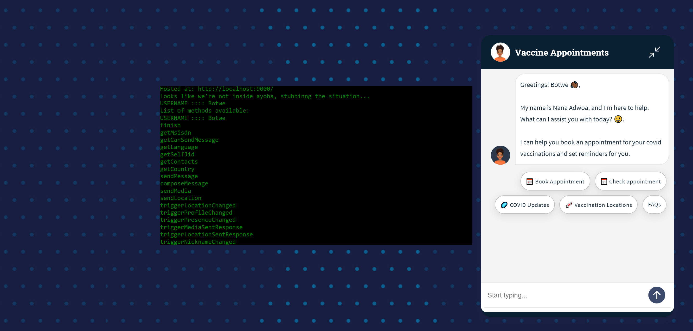
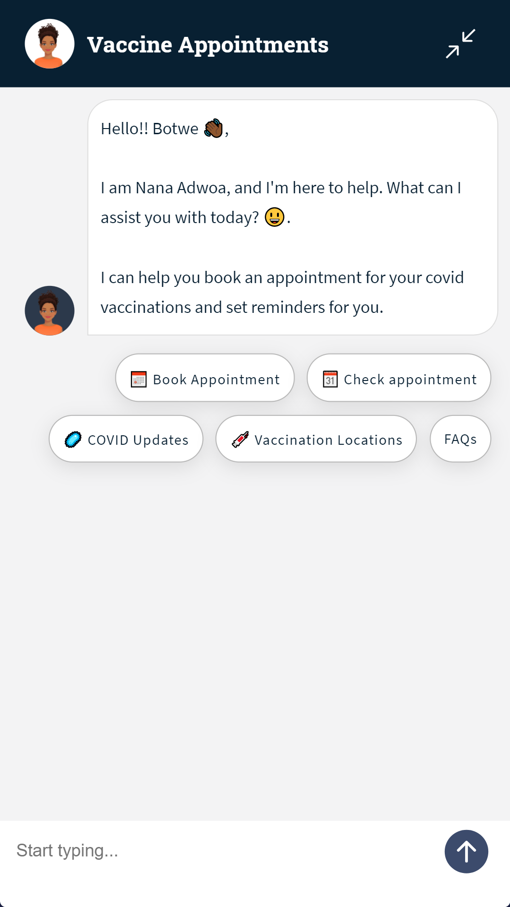
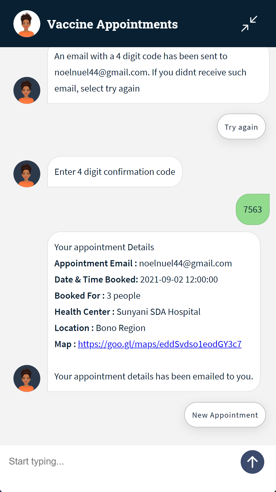
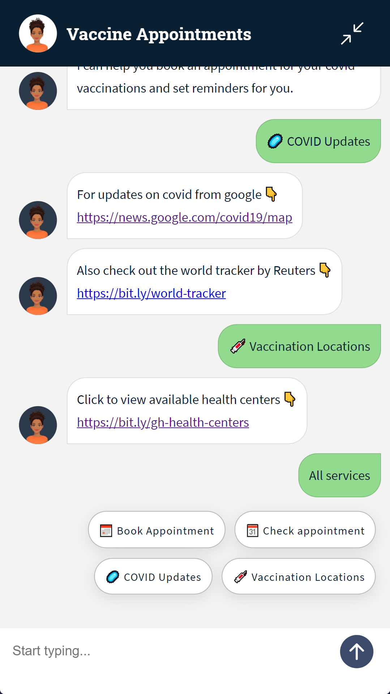

# Covid Vaccine Appointment ChatBot

<!--- Replace <OWNER> with your Github Username and <REPOSITORY> with the name of your repository. -->
<!--- You can find both of these in the url bar when you open your repository in github. -->

## 📙 Description

A conversational bot(Nana Adwoa) allowing users to book days with available slots to take covid vaccine.

## Demo

Check out our website for a live [demo](https://ayoba-vaccine-appointment.herokuapp.com). Check out powerpoint presentation [here](https://docs.google.com/presentation/d/15ngthr34YJKQUNxpUPxXAg6FpkjXP94W8UhjAyZ91M8/edit?usp=sharing)

https://user-images.githubusercontent.com/16451643/131744284-d95036cc-ea61-4f0f-83fb-979674716d28.mp4

## 💡 Motivation and Context

<!--- Describe your app in one or two sentences -->

COVID-19 infections are increasing in Ghana, with 420 new infections reported on average each day. That's 54% of the peak — the highest daily average reported on July 28. During the last week reported, Ghana averaged about 719 doses administered each day. At that rate, it will take a further 8,460 days to administer enough doses for another 10% of the population. [Source](https://graphics.reuters.com/world-coronavirus-tracker-and-maps/countries-and-territories/ghana/)

As taking Vaccines is still in progress, most of the population are busy and would find it difficult going to join long queues to take Vaccines Shot. Even though their health is important, the quality of health service they get also depends on the amount of money they make as such the decision of leaving work for the vaccination becomes difficult to make.

The solution here is simple, a simple conversational assistant or chat bot integrated into the ayoba platform allowing users to book days with available slots to take covid vaccine.

## ⚙️ Getting Started

This project is configured to run both the [chat widget](https://github.com/MTN-AYOBA-HACK-2021/ayoba_botchway44/tree/master/src/widget) and an [express application](https://github.com/MTN-AYOBA-HACK-2021/ayoba_botchway44/tree/master/src/app) together. It bundles the chat widget into a single js file in the [dist folder]()

- **[assets](https://github.com/MTN-AYOBA-HACK-2021/ayoba_botchway44/tree/master/assets)** - Contains static shared assets like images, fonts & svgs for the projects
- **[cx-model](https://github.com/MTN-AYOBA-HACK-2021/ayoba_botchway44/tree/master/cx-model)** The exported dialogflow-cx agent
- **[src/app](https://github.com/MTN-AYOBA-HACK-2021/ayoba_botchway44/tree/master/src/app)** - Nodesjs server for detecting intents and handling fulfillments
- **[src/widget](https://github.com/MTN-AYOBA-HACK-2021/ayoba_botchway44/tree/master/src/widget)** - Web component written in typescript and uses rollup to bundle into minifies js files with `npm run build:widget` command.
- **[src/model](https://github.com/MTN-AYOBA-HACK-2021/ayoba_botchway44/tree/master/src/models)** - Contains the shared model for the project

For a detailed instruction on running this project locally, [click here](https://github.com/MTN-AYOBA-HACK-2021/ayoba_botchway44/tree/master/assets/PROJECT.md#%EF%B8%8F-getting-started)

<!-- ## :bulb: Motivation and Context
Dialogflow CX Competition -->
<!--- What are you especially proud of? -->

## 📸 Screenshots

| 1                                             | 2                                             |
| --------------------------------------------- | --------------------------------------------- |
|  |  |

| 3                                             | 4                                             |
| --------------------------------------------- | --------------------------------------------- |
|  |  |

## Built with

- Dialogflow CX
- Nodejs with Typescript
- Mongodb

## Credits

- Bot conversation video created with [Synthesia](https://www.synthesia.io/request-demo)
- Email templates design created with [Designmodo](https://designmodo.com/postcards/)

## License

See [LICENSE](https://github.com/MTN-AYOBA-HACK-2021/ayoba_botchway44/tree/master/LICENSE).
